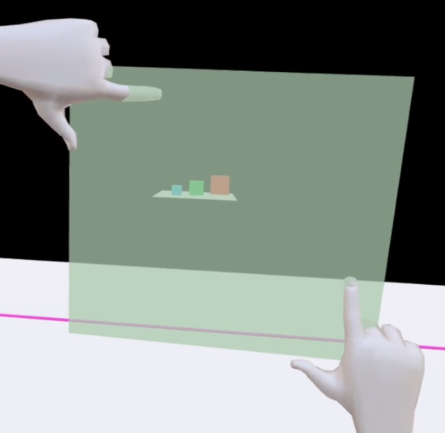
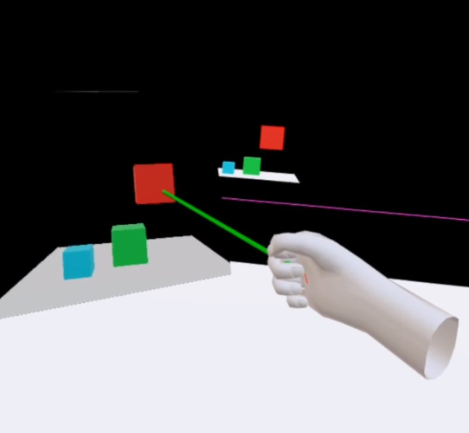
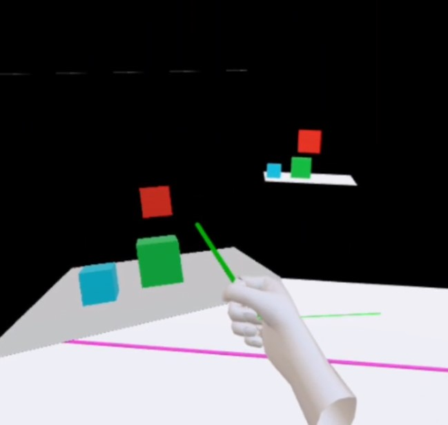
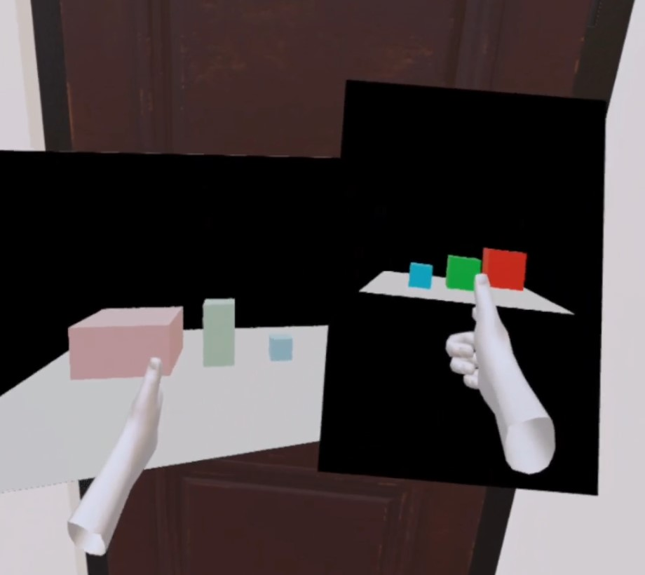

# Picture Frame: A Long Distance Virtual Object Interaction Technique

This is a research project made by Ian Morrissey and Jacob Walters of the University of Minnesota, made for the CSCI5619 class on virtual reality. 

## Ian Morrissey & Jacob Walters

### Project Description

The picture frame is a long distance interaction technique that allows the user to create a picture frame as a secondary view of the virtual world. Through this frame, a variety of interactions are available to them. 

The user can place a frame through a "framing gesture" described below, and through that frame they can select objects, translate them, and manipulate their depth. The frame can be picked up, rotated, and moved around, and the image on the frame will not change, as if it was a static camera. The frame can also be zoomed in and out, in order to make it easier to manipulate objects that are far away. 



**Instructions**

The test environment involves a few scenarios in which the frame might be useful. The colored cubes can be picked up and moved around through a picture frame, and they will fall and tumble like physical objects. The target can also be moved. 

The controls involve various gestures that are intuitively refelcted in the models that represent the user's hand. This is done by detecting which buttons are being touched. There are four hand positions that are recognized (on each hand):

- No buttons touched, triggers squeezed: open hand
- Stick or buttons touched: pointing hand
- Trigger touched: thumbs up
- Trigger and stick/button touched: fist

Additionally, most gestures are "activated" by pressing the trigger button. 

**Locomotion**

Basic locomotion is enabled to move around the scene as necessary. This is only available on the right hand, through simple point and click teleportation. Make the "pointing" gesture by touching the stick or buttons on the right controller, and a laser will appear. If this intersects with the ground, pressing the trigger allows you to teleport. Moving the right stick left or right will activate a snap turn.

**Picture frame creation**

Make the "open hand" gesture with both hands, by squeezing both grip buttons and touching no other inputs. Then, make a "frame" with your pointer and thumb fingers as such:

To create the frame, press the trigger on eiether controller.

**Picture frame movement**

You can grab frames with the squeeze button and move them around. While holding a frame in your left hand you can still teleport and turn.

**Picture frame deletion**

To delete a frame, grab it and flip it 180 degrees, so that the front side now faces the back side. When this is done, the texture will change into a red X, and when you release it the frame will be deleted.

**Picture frame object manipulation**

Once a frame is been made, the target and all colored cubes can be grabbed. You can select them by performing the pointing gesture, pointing at a selectable object on the frame, and pressing the trigger button to select them. While holding the trigger button, the selected object can be moved around. 

To change the depth of the object, you can move your hand closer or further away from the picture frame. A "depth line" is drawn to give you a visual cue on if your hand is far enough to begin depth manipulation. 





**Picture frame zoom**

To zoom in or out, grab a picture frame with both hands and move your hands together or away. 

**Test bed**

The test environment has a few scenarios that show off potential  use cases of the picture frame. The objects on the far platform would be difficult to grab with traditional point and click methods, so you can use a frame and zoom in to get a closer view of the objects. 

The cubes behind the wall show how the picture frame allows you to manipulate the cubes even when they are obscured behind the wall.

The door in the environment also opens when the laser hits the target—you can move the target while standing in front of the door using a frame. 



### Development

To build, pull this repository down and run the following commands:

```
npm install
npm run start
```

### Credit & Used Assets

Original hand model from:

https://www.blendswap.com/blend/7894

Castle model from:

https://clara.io/view/dd0eae3a-86a5-40d2-bc60-45307297519e#

Fountain model from:

https://assetstore.unity.com/packages/3d/fountain-prop-75912

Door model from:

https://assetstore.unity.com/packages/3d/props/interior/classic-interior-door-pack-1-118744

Trophy model from:

https://assetstore.unity.com/packages/3d/props/too-many-items-trophies-127644

